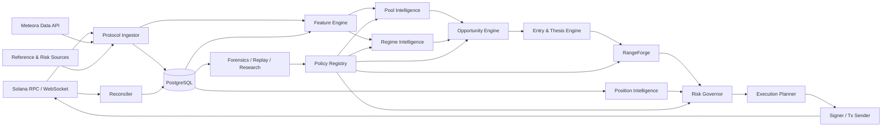

> **Project:** LPForge  
> **Suite Version:** 1.0  
> **Design Baseline Date:** 12 August 2026  
> **Status:** Build-guiding baseline  
> **Scope:** Meteora DLMM liquidity intelligence, decisioning, simulation, execution and operations  
> **Principle:** Protocol truth is observed; trading intelligence is inferred; execution is deterministic.  


# LPForge Technical Architecture and System Design

## 1. Architecture Style

LPForge v1 should be a **modular monolith with independently runnable workers**, not a microservice fleet.

Reasons:
- keeps domain logic centralized;
- avoids distributed-state complexity before an edge is proven;
- allows collector, decision, executor and API workers to be separated operationally;
- preserves a migration path to services if scale demands it.

## 2. Recommended Technology Baseline

### Production runtime
- TypeScript on a supported Node.js LTS line.
- Official `@meteora-ag/dlmm` SDK for protocol integration.
- `@solana/web3.js`/current Solana dependencies compatible with the SDK.
- PostgreSQL as authoritative application database.
- Object storage or compressed Parquet files for large replay datasets.
- No Redis requirement in v1; use PostgreSQL-backed jobs/advisory locks unless evidence shows a bottleneck.

### Research
- Python may be used for offline statistical analysis, notebooks and model research.
- Production strategy decisions must use versioned exported models/rules with reproducible inference.
- Critical accounting/simulation formulas should have golden-vector tests shared across languages.

## 3. Logical Components



## 4. Repository Layout

```text
lpforge/
  apps/
    collector/
    decision-worker/
    position-worker/
    executor/
    api/
    operator-ui/
    replay/
  packages/
    domain/
    meteora/
    solana/
    persistence/
    features/
    pool-intelligence/
    regime/
    opportunity/
    rangeforge/
    position-intelligence/
    risk/
    execution/
    simulator/
    policy/
    observability/
  research/
  migrations/
  policies/
  docs/
  tests/
```

## 5. Data Ownership

PostgreSQL is authoritative for:
- normalized observations;
- decisions;
- policies;
- plans;
- transaction intent;
- reconciliation;
- forensic episodes.

On-chain is authoritative for:
- actual pool state;
- actual position state;
- balances;
- claimable fees/rewards;
- confirmed transactions.

External sources are never authoritative for on-chain balances.

## 6. Worker Responsibilities

### Collector
- pool discovery/backfill through Meteora Data API;
- Solana websocket/log subscription;
- event decoding;
- periodic account snapshots;
- external reference price/risk ingestion;
- freshness tracking.

### Decision worker
- computes immutable decision snapshots;
- runs pool/regime/opportunity/entry/range engines;
- asks Risk Governor;
- creates `PositionPlan` only.

It cannot sign.

### Position worker
- watches open positions;
- recomputes thesis validity and forward EV;
- proposes management plans.

It cannot sign.

### Executor
- receives an already risk-approved plan;
- revalidates freshness and on-chain state;
- simulates;
- builds/signs/sends;
- records transaction intent/result.

It cannot invent a strategy.

### Reconciler
- independently reads on-chain state after writes and periodically;
- detects orphaned/partial/mismatched actions;
- repairs database projections only from evidence.

## 7. Scheduling Model

Use event-driven updates for:
- swaps;
- position writes;
- fee/reward claims;
- rebalances;
- pool updates when emitted.

Use periodic refresh for:
- Meteora API aggregates;
- external price/risk;
- open-position state;
- stale feature recomputation;
- protocol compatibility.

No decision may use a feature whose age exceeds policy.

## 8. Idempotency

Every action has:
- `decision_id`;
- `plan_id`;
- `execution_intent_id`;
- deterministic idempotency key;
- expected pre-state hash;
- expected target-state hash.

The executor must reject replayed intents unless explicitly marked retryable and the on-chain pre-state is still valid.

## 9. Concurrency

Use PostgreSQL advisory locks keyed by:
- pool address for pool-state mutations;
- position address for management;
- wallet for transaction sequencing.

Two decision workers may assess the same pool; only one plan may reserve capital for the same opportunity/policy window.

## 10. Failure Isolation

If an external risk provider fails:
- existing positions continue under local/on-chain risk controls;
- new entries requiring that provider are blocked if policy marks it mandatory.

If Meteora Data API fails:
- critical on-chain position management continues from RPC/event data;
- pool discovery and aggregate metrics degrade;
- new entry may be blocked if required aggregates are stale.

If RPC fails:
- no writes;
- no state-changing assumptions;
- fail over to configured secondary RPC after health checks.

## 11. Policy Registry

Policies are immutable objects:

```text
policy_id
version
parent_version
status: DRAFT|RESEARCH|SHADOW|PAPER|LIMITED_LIVE|PRODUCTION|RETIRED
feature_schema_version
model_artifacts
configuration
created_at
promoted_at
evidence_bundle_id
```

A running decision records the exact policy ID.

## 12. API Surface

Operator API should expose:
- health;
- pools and eligibility;
- opportunities and reason codes;
- current regimes;
- range candidates;
- open positions;
- management recommendations;
- risk state;
- executions;
- forensic episodes;
- policy comparisons.

No public write endpoint should directly accept arbitrary raw Solana transactions.

## 13. Deployment Principle

Start with one PostgreSQL instance and a small number of Node processes. Scale only measured bottlenecks. The system's sophistication should live in domain reasoning, not infrastructure sprawl.
