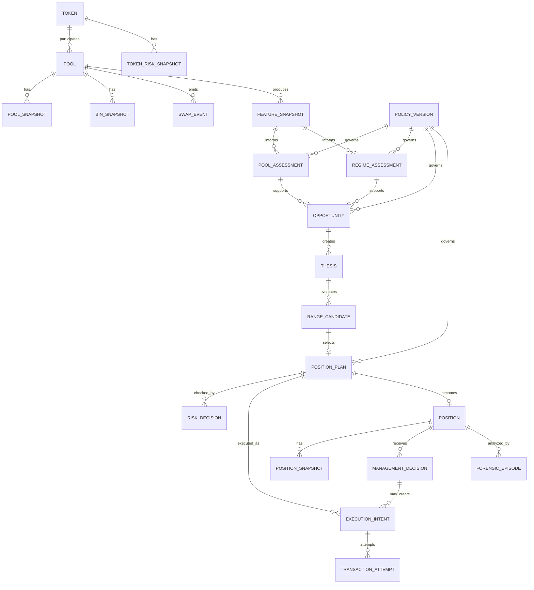

> **Project:** LPForge  
> **Suite Version:** 1.0  
> **Design Baseline Date:** 12 August 2026  
> **Status:** Build-guiding baseline  
> **Scope:** Meteora DLMM liquidity intelligence, decisioning, simulation, execution and operations  
> **Principle:** Protocol truth is observed; trading intelligence is inferred; execution is deterministic.  

# LPForge Data Model and ERD

## 1. Modeling Principles

1. Immutable observations; derived current views may be materialized.
2. Never overwrite a decision.
3. Store raw protocol identifiers alongside normalized values.
4. Every derived record references feature/policy versions.
5. Decimal/token values never use IEEE floating point for settlement/accounting.
6. Time-series rows contain source time, observed time and slot where applicable.

## 2. Core ERD

## 3. Protocol Tables

### `tokens`
- mint PK;
- symbol/name metadata;
- decimals;
- token program;
- first_seen_at;
- metadata provenance.

### `pools`
- address PK;
- token_x_mint FK;
- token_y_mint FK;
- created_at;
- bin_step;
- function_type;
- collect_fee_mode;
- current_status projection;
- protocol configuration identifiers.

### `pool_snapshots`
- pool;
- slot;
- active_bin_id;
- reserves X/Y;
- base/dynamic/max fee;
- protocol share;
- oracle state hash;
- reward state;
- observed_at;
- source.

### `bin_snapshots`
Partition by time/pool.
- pool;
- bin_id;
- slot;
- price_q64;
- UI price derived;
- amount_x/y;
- liquidity_supply;
- cumulative fee growth X/Y;
- limit-order fields if relevant;
- observed_at.

### `swap_events`
From `Swap2Evt` where available:
- signature + event_index unique;
- pool;
- user;
- slot/time;
- start/end bin;
- direction;
- amount_in/out/left;
- fee_bps;
- mm_fee;
- protocol_fee;
- limit_order_fee;
- host_fee;
- fee-side flags.

### `liquidity_events`
- add/remove/rebalance/composition fee;
- position;
- pool;
- amounts;
- old/new ranges;
- active bin;
- signature.

## 4. Market Data Tables

### `ohlcv`
- pool;
- timeframe;
- bucket;
- O/H/L/C;
- volume;
- origin (`METEORA_API`, `EVENT_DERIVED`);
- completeness.

### `external_prices`
- asset/mint;
- source;
- price;
- confidence;
- source time;
- observed time.

### `token_risk_snapshots`
- mint;
- holder count;
- freeze/mint authority state;
- verified/blacklist indicators;
- organic/risk provider fields;
- concentration metrics where available;
- source timestamps;
- raw payload hash.

## 5. Feature Tables

### `feature_snapshots`
One immutable feature vector per pool/time/version:
- feature schema version;
- source observation watermark;
- market features;
- bin features;
- flow features;
- fee features;
- risk features;
- freshness status;
- missingness map.

Important named features include:
- `active_bin_velocity_*`;
- `active_bin_directionality_*`;
- `local_liquidity_±N`;
- `liquidity_skew`;
- `liquidity_gap_score`;
- `swap_flow_imbalance`;
- `two_way_flow_ratio`;
- `fee_per_local_liquidity_*`;
- `dynamic_fee_persistence`;
- `pool_reference_divergence_bps`;
- realized volatility/ATR;
- range-return frequency;
- drawdown/recovery features.

## 6. Intelligence Tables

### `pool_assessments`
- assessment ID;
- pool;
- policy;
- quality score;
- economic score;
- toxicity score;
- eligibility;
- blockers[];
- evidence JSON.

### `regime_assessments`
- regime label;
- substate;
- probabilities by class;
- confidence;
- stability;
- transition probability;
- horizons;
- evidence.

### `opportunities`
- class;
- status;
- expected horizon;
- expected fee value;
- expected adverse inventory value;
- expected net LP value;
- uncertainty;
- reason codes;
- expiry.

### `theses`
Machine-readable contract:
- expected state;
- expected path;
- expected economics;
- allowed deterioration;
- invalidation conditions;
- review horizons;
- source IDs.

## 7. RangeForge Tables

### `range_candidates`
- strategy family;
- side/orientation;
- lower/upper bin;
- width;
- center/reference bin;
- per-bin weights;
- required X/Y;
- predicted range survival;
- predicted fee capture;
- predicted inventory path;
- predicted costs;
- expected net value;
- stress results.

### `position_plans`
- selected candidate;
- desired capital;
- exact position bounds;
- desired amounts/weights;
- max active-bin slippage;
- max cost;
- expiry;
- target-state hash.

## 8. Live Position Tables

### `positions`
Internal identity plus on-chain address:
- owner wallet;
- pool;
- on-chain position address;
- opening plan;
- lifecycle state;
- opened/closed time;
- current thesis;
- reconciliation state.

### `position_snapshots`
- active bin;
- range relationship;
- amounts X/Y;
- unclaimed/claimed fees;
- rewards;
- value by numeraire;
- HODL benchmark;
- in-range percentage;
- fee velocity;
- inventory conversion;
- current forward EV.

### `management_decisions`
- action;
- policy;
- forward EV hold;
- forward EV proposed action;
- incremental benefit;
- costs;
- risk;
- thesis status;
- reason codes.

## 9. Execution Tables

### `execution_intents`
- action;
- expected pre-state;
- target state;
- idempotency key;
- risk approval;
- expires_at.

### `transaction_attempts`
- signature;
- simulation result;
- compute units;
- priority/base fee;
- blockhash;
- sent/confirmed/finalized timestamps;
- error;
- retry relationship.

### `reconciliation_events`
- expected;
- observed;
- discrepancy;
- resolution;
- actor.

## 10. Research Tables

### `forensic_episodes`
- opportunity/position;
- entry context;
- timeline;
- realized result;
- attribution;
- counterfactual set;
- data-quality score.

### `experiments`
- hypothesis;
- treatment/control policy;
- data window;
- metrics;
- result;
- acceptance status.

### `policy_versions`
As defined in Architecture.

## 11. Database Constraints

Required:
- unique event signature/index;
- unique execution idempotency key;
- FK integrity for policy/feature versions;
- check lower_bin <= upper_bin;
- no confirmed live position without opening execution/reconciliation evidence;
- no `PRODUCTION` policy without evidence bundle.

Use migrations only. Never mutate schema manually in production.
